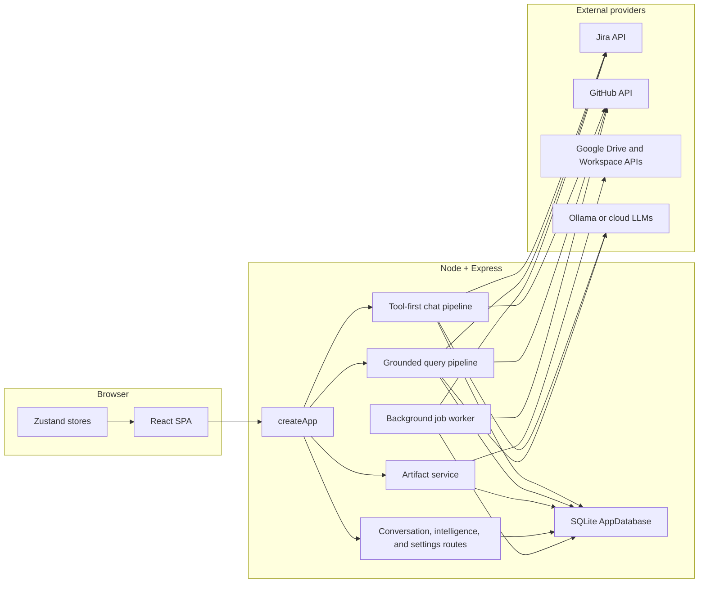

# Team Activity Monitor

Team Activity Monitor is a multi-tenant engineering workspace that combines:

- a chat-first AI interface for questions about team activity
- a grounded query pipeline for Jira and GitHub reporting
- Google artifact creation for docs, sheets, slides, charts, and exports
- an intelligence dashboard for live team status

It is built with Express 5, SQLite, TypeScript, and a React SPA that is compiled into `public/app` and served by the same Node process.

## What This Repo Does

The app has three main product surfaces:

- `Workspace`: the main chat experience in `client/src/pages/WorkspacePage.tsx`
- `Intelligence`: a live GitHub and Jira dashboard in `client/src/pages/IntelligencePage.tsx`
- `Settings`: provider connections, workspace config, team access, and audit activity in `client/src/pages/SettingsPage.tsx`

Under the hood, those surfaces share the same backend:

- `src/server.ts` boots config, SQLite, Express, and the background job worker
- `src/app.ts` wires auth, API routes, SPA serving, and the main AI endpoints
- `src/db.ts` is the typed SQLite access layer for users, orgs, sessions, messages, artifacts, tokens, and audit data

## Architecture At A Glance



For deeper diagrams and file-level guidance, see [docs/architecture.md](docs/architecture.md).

## Core Runtime Flows

### 1. Tool-first chat

`POST /api/v1/chat` drives the main workspace assistant:

- the client sends the user message, selected model, optional conversation id, and recent history
- `src/app.ts` resolves organization context and provider tokens
- `src/lib/chat-pipeline.ts` builds the system prompt, gives tool definitions to the LLM, and loops through tool calls
- `src/lib/tools/executor.ts` fetches live Jira and GitHub data in parallel
- the final answer is persisted to the conversation, along with source metadata and artifact suggestions

### 2. Grounded activity queries

The older structured query path is still supported through `POST /api/query` and the demo endpoints:

- `src/query/parser.ts` extracts intent, member, and timeframe
- `src/query/identity.ts` resolves names to team members
- `src/orchestrator/activity.ts` fetches Jira and GitHub activity and builds a normalized summary
- `src/lib/llm-pipeline.ts` turns that summary into a grounded natural-language answer

### 3. Artifact creation

Artifact creation is asynchronous:

- the chat UI renders artifact suggestions and creation actions
- `POST /api/v1/artifacts` inserts a `creating` row immediately
- `src/lib/artifacts/service.ts` creates and populates Google Docs, Sheets, Slides, or export files
- the client polls artifact status and upgrades the creation shell into a ready artifact card

## Repo Map

| Path | Purpose |
|---|---|
| `client/` | React SPA, routes, Zustand stores, chat UI, artifact UI |
| `src/app.ts` | Main Express application wiring and route registration |
| `src/server.ts` | Process bootstrap and job worker startup |
| `src/routes/` | Focused routers for conversations, artifacts, intelligence, and LLM utilities |
| `src/lib/chat-pipeline.ts` | Tool-first multi-turn chat orchestration |
| `src/lib/tools/` | Chat tool definitions and execution |
| `src/lib/artifacts/` | Artifact specs, Google integrations, and orchestration |
| `src/orchestrator/` | Grounded activity summary assembly |
| `src/adapters/` | Jira and GitHub API adapters |
| `src/llm/` | Provider registry and model adapters |
| `src/db.ts` | SQLite schema setup and typed data access methods |
| `tests/` | Vitest and Supertest coverage |
| `docs/` | Architecture and product notes |

## Local Setup

```bash
npm install
cp .env.example .env
npm run dev
```

Open [http://localhost:3000](http://localhost:3000).

### Local model with Ollama

```bash
ollama pull qwen2.5:7b
npm run llm:check
```

Set:

```env
OLLAMA_BASE_URL=http://localhost:11434/api
OLLAMA_MODEL=qwen2.5:7b
```

### Fixture mode vs live mode

- `USE_RECORDED_FIXTURES=true` uses data from `fixtures/demo/`
- `USE_RECORDED_FIXTURES=false` enables live Jira and GitHub calls

Live mode typically requires:

```env
JIRA_BASE_URL=https://your-org.atlassian.net
JIRA_EMAIL=service-account@your-org.com
JIRA_API_TOKEN=...
GITHUB_TOKEN=...
```

Google artifact creation and user-scoped provider access are enabled through OAuth connections stored in SQLite.

### Invitation email setup

The app already supports sending organization invitations by email through Resend. To enable it, set:

```env
RESEND_API_KEY=re_...
EMAIL_FROM=Team Activity <noreply@mail.yourdomain.com>
APP_BASE_URL=https://app.yourdomain.com
```

Outside the repo, you will still need:

- a [Resend](https://resend.com/) account and API key
- a verified sending domain or sender identity in Resend
- a real public app URL in `APP_BASE_URL` so invite links resolve correctly

Without that setup, invitations still work, but the app stays in manual-share mode and returns a copyable invite link instead of sending email automatically.

## Common Commands

```bash
npm run dev
npm test
npm run build
npm run typecheck
npm start
npm run cli -- "what did the team ship this week?"
```

Single test examples:

```bash
npx vitest run tests/query-parser.test.ts
npx vitest run -t "parses timeframe"
```

## Development Notes

- backend TypeScript is strict and uses ES modules
- local backend imports must use `.js` extensions
- sessions, organizations, provider tokens, conversations, and artifacts all live in SQLite
- mutating endpoints require CSRF tokens
- `createApp(config, logger, database)` is intentionally dependency-injected for testability

## Further Reading

- [Architecture diagrams and subsystem walkthrough](docs/architecture.md)
- [UX design notes for the chat workspace](docs/ux-design-plan.md)
