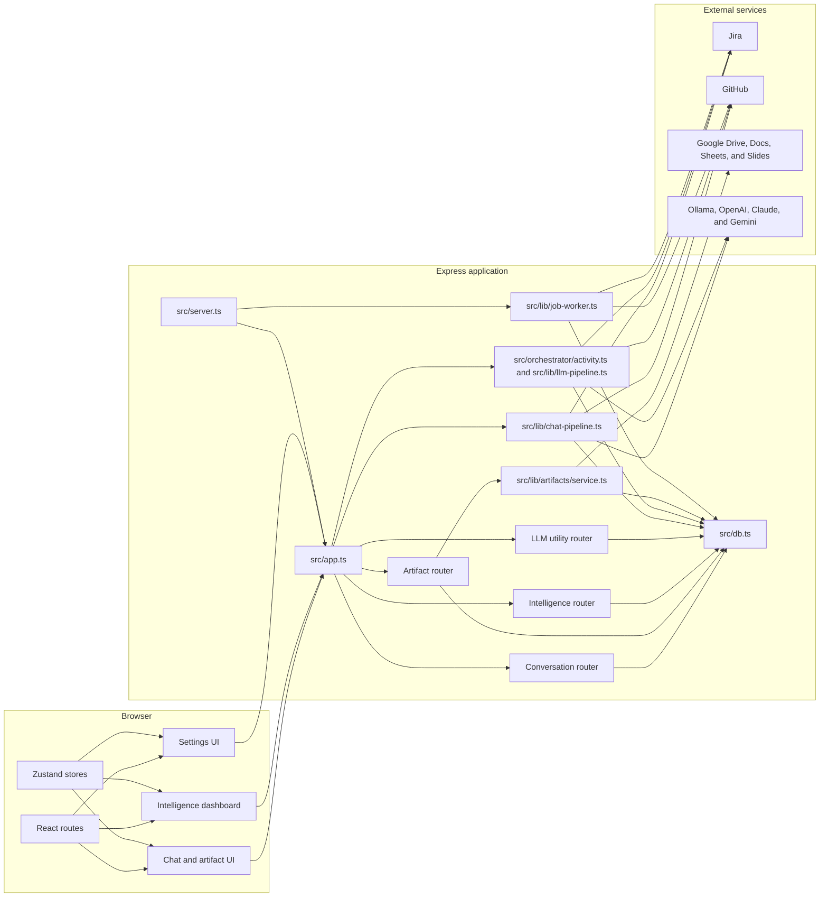
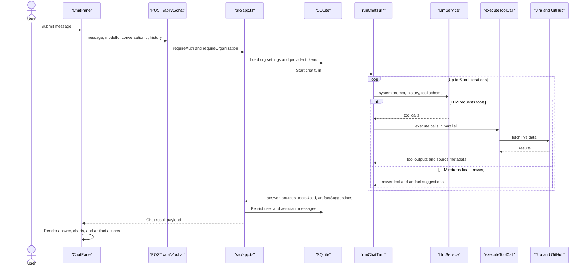
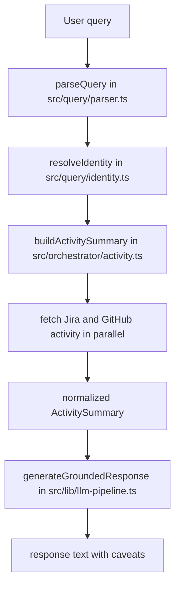
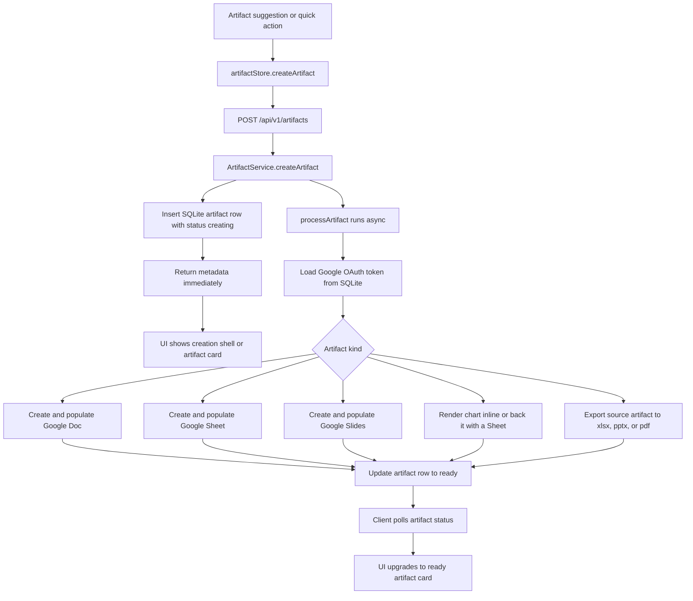

# Architecture

This document explains how the current repository is put together, from the React workspace down to the provider integrations.

## System Overview

## Main Runtime Pieces

### Backend

- `src/server.ts` is the real process entry point. It loads config, initializes SQLite, builds the Express app, and starts the job worker.
- `src/app.ts` is the central composition root. It mounts auth, sessions, security middleware, API routes, webhook handlers, and the SPA fallthrough routes.
- `src/db.ts` is the persistence boundary. It owns schema initialization and typed CRUD access for users, organizations, sessions, provider connections, conversations, artifacts, projects, and audit data.

### Frontend

- `client/src/App.tsx` defines the SPA shell and top-level routes.
- `client/src/pages/WorkspacePage.tsx` is the chat workspace composed from `HistorySidebar` and `ChatPane`.
- `client/src/store/chatStore.ts`, `artifactStore.ts`, `intelStore.ts`, and `sessionStore.ts` coordinate client-side data loading and mutations.

### External integrations

- Jira and GitHub power both the chat tools and the structured activity pipeline.
- Google OAuth plus Drive and Workspace APIs power artifact creation.
- The LLM layer is provider-agnostic through the service and registry in `src/llm/`.

## Chat Request Flow

The chat workspace uses a tool-first loop rather than a single-shot prompt.

### Notes

- Tool turns are internal to the pipeline and are not persisted as first-class conversation messages.
- The LLM is given a bounded tool inventory from `src/lib/tools/definitions.ts`.
- `src/lib/tools/executor.ts` handles live fetches, caching, and partial-failure reporting.

## Structured Query Flow

The repo still contains the earlier grounded reporting pipeline, which is used by `/api/query`, demo endpoints, and the CLI.

This flow is more structured than the chat pipeline. It decides the intent first, then retrieves only the data needed for that fixed intent.

## Artifact Lifecycle

Artifacts are intentionally asynchronous so the UI can show progress immediately.

### Notes

- `src/lib/artifacts/service.ts` is the single orchestration entry point.
- Google Docs, Sheets, and Slides are created via Drive first, then populated by the corresponding API.
- Chart artifacts can stay client-rendered or optionally create a backing Sheet.

## Persistence Domains

The SQLite layer in `src/db.ts` carries several concerns in one file, but the data naturally falls into a few domains:

- `identity and tenancy`: users, organizations, memberships, invitations
- `auth and provider access`: sessions, OAuth connections, encrypted model keys
- `workspace data`: conversations, messages, projects, artifacts
- `ops and audit`: audit events, query runs, background jobs, connector health

That split is useful when navigating the code: UI features usually map cleanly to one of those domains even though the implementation lives behind one database module.

## Where To Start In The Codebase

If you are new to the repo, this order gives the fastest orientation:

1. Read `src/server.ts` to understand process startup.
2. Read `src/app.ts` to see every mounted route and service boundary.
3. Read `client/src/App.tsx` and `client/src/pages/WorkspacePage.tsx` for the SPA shell.
4. Follow `src/lib/chat-pipeline.ts` for the main AI path.
5. Follow `src/lib/artifacts/service.ts` for the artifact path.
6. Read `src/db.ts` last, as the persistence reference rather than the starting point.
