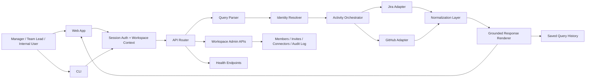
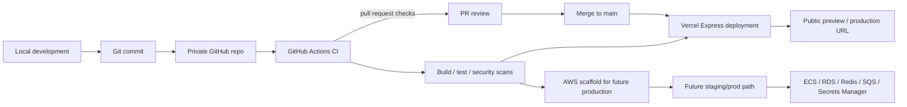

# Team Activity Monitor Diagrams

This document is a quick visual reference for how the product works today.
It focuses on the real implementation path: natural-language query, identity resolution, Jira/GitHub fetch, grounded response, and the delivery pipeline around it.

## 1) Product / System Overview



## 2) AI / Query Pipeline

```mermaid
flowchart TD
  Q[User question<br/>"What is John working on these days?"] --> Parse[Parse intent, member text, and timeframe]
  Parse --> Resolve[Resolve person from alias map and workspace config]
  Resolve -->|unclear| Clarify[Return clarification instead of guessing]
  Resolve -->|clear| Split{Requested sources}

  Split --> JiraFetch[Jira: assigned issues + recent updates]
  Split --> GitHubCommits[GitHub: recent commits]
  Split --> GitHubPRs[GitHub: open / recently updated PRs]

  JiraFetch --> Normalize[Normalize into ActivitySummary]
  GitHubCommits --> Normalize
  GitHubPRs --> Normalize

  Normalize --> Ground[Render grounded answer]
  Ground --> Output[Overview + Jira + GitHub + Caveats]

  Normalize --> Save[Persist query run + audit event]
  Save --> History[Query history in workspace]
```

### What the pipeline is doing

- The parser extracts the question shape first, before any provider calls.
- Identity resolution uses the configured teammate aliases and workspace settings.
- Jira and GitHub are fetched separately so the answer can stay grounded and source-specific.
- The response renderer only formats normalized facts and caveats.
- If a source fails, the app still returns the surviving source and calls out the partial result.

## 3) Deployment / Delivery Pipeline



### Delivery notes

- The current hosted path is Vercel because it gives the app a clean Express deployment target plus preview environments and AI Gateway integration.
- GitHub Actions is the primary automation layer for build, test, security, and deployment checks.
- The AWS lane is scaffolded so the app can graduate to ECS, RDS, Redis, and SQS without redesigning the product flow.

## 4) Reading Guide

- `Web / CLI` are thin entry points into the same server-side app logic.
- `Session Auth + Workspace Context` is how the app knows who you are and which organization is active.
- `Activity Orchestrator` is the central fan-out layer that coordinates Jira and GitHub.
- `Normalize` is what keeps the response honest and consistent.
- `History / Audit / Admin` are the product trust surfaces that make this feel like an internal tool rather than a toy.
